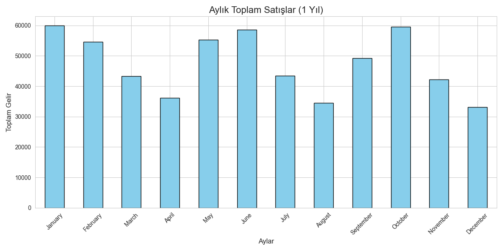
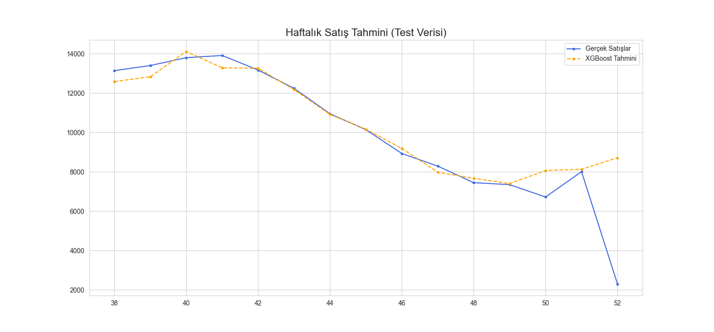

# 📈 İlaç Satış Analizi ve XGBoost Tahmini / Drug Sales Analysis & XGBoost Forecasting

  
  
  

  Bu proje, bir örnek ilaç firmasında ürün satışlarının analiz edilmesi ve XGBoost algoritması kullanılarak gelecek satışların tahmin edilmesi amacıyla hazırlanmıştır.
  Veri seti, her ürünün kendi içinde tutarlı bir zaman serisi deseni izlediği, senaryo bazlı ve dinamik olarak üretilmiş simüle edilmiş verilerdir. Bu yaklaşım, modelin tahmin yeteneğini test etmek için ideal bir ortam sağlar.

  This project analyzes product sales in a sample pharmaceutical company and forecasts future sales using the XGBoost algorithm.
  The dataset is scenario-based and dynamically generated, with each product following its own consistent time-series pattern, providing an ideal environment for testing the model's forecasting capabilities.

---

## 🧠 Proje Amacı / Project Goal

- 💡 Tutarlı desenlere sahip sentetik satış verisi üreterek analiz ve modelleme yapmak / Generate and analyze synthetic sales data with consistent patterns for modeling
- 📅 Aylık ve ürün bazlı satış dinamiklerini görselleştirmek / Visualize monthly and product-based sales dynamics
- 🛠️ Etkili özellik mühendisliği (Feature Engineering) ile model performansını artırmak / Enhance model performance through effective feature engineering
- 🤖 XGBoost modeliyle gelecek haftalık satışları yüksek doğrulukla tahmin etmek / Forecast upcoming weekly sales with high accuracy using XGBoost

---

## ⚙️ Kullanılan Teknolojiler / Technologies

| Alan / Area | Teknoloji / Technology |
|-------------|-----------------------|
| Programlama Dili / Language | Python |
| Kütüphaneler / Libraries | pandas, numpy, matplotlib, seaborn, scikit-learn, xgboost |
| Model / Model | XGBoost Regressor |
| Ortam / Environment | Jupyter Notebook / Google Colab / VS Code |

---

## 🧩 Veri Seti Bilgileri / Dataset Info

| Sütun / Column | Açıklama / Description |
|----------------|----------------------|
| Date | Satış tarihi / Sale date |
| Product | Ürün adı / Product name (A, B, C) |
| Unit_sold | Satılan miktar / Units sold |
| Price | Birim fiyat / Unit price |
| TotalSales | Toplam satış geliri / Total sales revenue |

---

## 📊 Veri Analizi ve Görselleştirmeler / Visualizations

### 1️⃣ Yıllık Toplam Satışlar / Total Annual Sales

  

**TR:** 12 aylık dönemdeki toplam satış gelirleri, belirgin bir mevsimsellik göstermektedir. Satışlar Ocak, Haziran ve Ekim aylarında zirve yaparken, özellikle bahar ve yaz sonu aylarında düşüşler yaşanmaktadır.
**EN:** The total sales revenue over the 12-month period shows significant seasonality. Sales peak in January, June, and October, while dips are experienced particularly in the spring and late summer months.

**Analitik Not / Analytical Note:** Bu mevsimsel döngü, stok yönetimi ve pazarlama kampanyalarının yılın doğru zamanlarında planlanması için kritik bir bilgidir.

---

### 2️⃣ Ürün Bazında Toplam Gelir / Total Revenue by Product

  

**TR:** Gelir bazında Ürün C, yaklaşık 260,000 birim ile en büyük katkıyı sağlamaktadır. Onu 200,000 birim ile Ürün A takip ederken, Ürün B en az geliri getirmiştir.
**EN:** In terms of revenue, Product C is the largest contributor with approximately 260,000 units. It is followed by Product A with 200,000 units, while Product B generated the least revenue.

**Analitik Not / Analytical Note:** Bu analiz, kârlılığın büyük ölçüde C ve A ürünlerine dayandığını gösterir. Bu ürünler, stratejik fiyatlandırma ve tedarik zinciri yönetimi için öncelikli olmalıdır.

---

### 3️⃣ Ürün Bazında Satılan Toplam Birim / Total Units Sold by Product

  

**TR:** Birim satış adedinde Ürün A, yaklaşık 10,000 adetle açık ara liderdir. En çok geliri getiren Ürün C'nin, Ürün A'nın yaklaşık yarısı kadar satılması, C'nin yüksek fiyatlı ve yüksek kâr marjlı bir ürün olduğunu doğrulamaktadır.
**EN:** In terms of unit sales, Product A is the clear leader with approximately 10,000 units. The fact that Product C, the top revenue generator, sells about half as many units as Product A confirms that C is a high-price, high-margin product.

**Analitik Not / Analytical Note:** Şirketin "hacim lideri" Ürün A iken, "kârlılık lideri" Ürün C'dir. Bu iki ürün için farklı pazarlama stratejileri geliştirilmelidir.

---

## 🧠 Modelleme ve Performans / Modeling & Performance

**Kullanılan Özellikler / Features Used:**
- `Rolling_Mean_4`: Son 4 haftanın satış ortalaması, modele yakın geçmişteki trendi hatırlatır.
- `Lag1`, `Lag2`: Bir ve iki hafta önceki satış değerleri.

**Model Değerlendirme / Evaluation Metrics:**

| Metric | TR Açıklama | Value |
|--------|-------------|-------|
| MAE (Ortalama Mutlak Hata) | Tahminlerin ortalama sapma miktarı | 732.82 |
| RMSE (Kök Ortalama Kare Hata) | Büyük hatalara daha duyarlı sapma ölçüsü | 1716.61 |
| R² (R-Kare) | Modelin verideki değişkenliği açıklama yüzdesi | 0.72 |

**TR Analiz / Analysis (TR):**
- MAE 732.82: Tahminler, gerçek haftalık satışlardan ortalama 733 birim sapmaktadır.
- R² 0.72: İyi bir skor! Bu, modelimizin satışlardaki değişkenliğin **%72'sini** başarıyla açıklayabildiğini gösterir.
> ✅ Bu başarılı performans, tutarlı desenler içeren veri seti ve etkili özellik mühendisliği (`Rolling_Mean`) sayesinde elde edilmiştir.

**EN Analysis / Analysis (EN):**
- MAE 732.82: On average, predictions deviate by 733 units from actual weekly sales.
- R² 0.72: A good score! This shows that our model can successfully explain **72%** of the variance in sales.
> ✅ This successful performance was achieved thanks to the dataset with consistent patterns and effective feature engineering (`Rolling_Mean`).

---

### 🤖 XGBoost Haftalık Satış Tahmini / Weekly Sales Forecast

  

**TR:** Model, test verileri üzerinde yüksek bir performans sergilemiştir. Mavi (gerçek) ve turuncu (tahmin) çizgilerin birbirini çok yakından takip etmesi, modelin genel trendi ve dalgalanmaları yakalamadaki başarısını görsel olarak kanıtlamaktadır.
**EN:** The model demonstrated high performance on the test data. The close tracking of the blue (actual) and orange (predicted) lines visually proves the model's success in capturing the overall trend and fluctuations.

---

## 💡 Sonuçlar / Conclusion

- 🔹 En yüksek satış hacmine sahip ürün: **Ürün A / Product A**
- 🔹 En yüksek gelir sağlayan ürün: **Ürün C / Product C**
- 🔹 XGBoost modeli, **R²=0.72** skoru ile haftalık satışları başarılı bir şekilde tahmin etmektedir.
- 🔹 Özellik mühendisliği, modelin tahmin gücünü artıran en kritik faktör olmuştur.

---

### 👨‍💻 Geliştirici / Developer

  <b>Yavuz ÇANDIR</b>
   
  

